# Dentalization App - Architecture Overview

## System Architecture Overview

Dentalization App adalah aplikasi mobile berbasis React Native untuk diagnosis dental menggunakan AI, dengan backend Node.js dan database PostgreSQL.

## High-Level Architecture

```mermaid
graph TB
    subgraph "Client Layer"
        A["📱 React Native App<br/>(iOS & Android)"]
    end
    
    subgraph "API Layer"
        B["🚀 Node.js Backend<br/>(Express + Prisma)"]
    end
    
    subgraph "Data Layer"
        C["🗄️ PostgreSQL Database"]
    end
    
    subgraph "External Services"
        D["🤖 AI/ML Service"]
        E["📧 Email Service"]
        F["☁️ File Storage"]
    end
    
    A -."HTTPS/REST API".-> B
    B -."Prisma ORM".-> C
    B -."API Calls".-> D
    B -."SMTP".-> E
    B -."Upload".-> F
    
    classDef client fill:#e1f5fe,stroke:#01579b,stroke-width:2px
    classDef api fill:#f3e5f5,stroke:#4a148c,stroke-width:2px
    classDef data fill:#e8f5e8,stroke:#1b5e20,stroke-width:2px
    classDef external fill:#fff3e0,stroke:#e65100,stroke-width:2px
    
    class A client
    class B api
    class C data
    class D,E,F external
```

## Key Components

### 1. Frontend (React Native)
- **Platform**: Cross-platform mobile app (iOS & Android)
- **State Management**: Redux dengan persistent storage
- **Navigation**: Role-based navigation (Doctor/Patient)
- **Authentication**: JWT dengan biometric support

### 2. Backend (Node.js + Express)
- **API**: RESTful API dengan middleware security
- **ORM**: Prisma untuk database operations
- **Authentication**: JWT dengan refresh tokens
- **File Handling**: Multer untuk upload gambar

### 3. Database (PostgreSQL)
- **Users**: User accounts dengan role-based access
- **Profiles**: Doctor dan Patient profiles
- **Medical Data**: Dental photos, diagnoses, medical records
- **Sessions**: Authentication sessions

### 4. External Services
- **AI/ML**: Service untuk analisis dental photos
- **Email**: Notifikasi dan verifikasi email
- **Storage**: Cloud storage untuk file uploads

## Security Features

- 🔐 **JWT Authentication**: Access & refresh tokens
- 🛡️ **Rate Limiting**: Protection against abuse
- 🔒 **Data Encryption**: Sensitive data protection
- 👆 **Biometric Auth**: Fingerprint/Face ID support
- 🚫 **Input Validation**: Request validation middleware

## Key Features

- 🤖 **AI Dental Diagnosis**: Photo analysis dengan machine learning
- 👨‍⚕️ **Doctor Portal**: Diagnosis history, patient management
- 👤 **Patient Portal**: Profile, medical records, photo upload
- 📊 **Analytics**: Statistics dan reporting
- 📅 **Appointments**: Scheduling system
- 📱 **Cross-Platform**: iOS dan Android support

## Technology Stack

| Layer | Technology |
|-------|------------|
| **Frontend** | React Native, Redux, AsyncStorage |
| **Backend** | Node.js, Express, Prisma ORM |
| **Database** | PostgreSQL |
| **Authentication** | JWT, Biometric APIs |
| **File Storage** | Multer, Cloud Storage |
| **AI/ML** | External AI Service |
| **Development** | Expo, ESLint, Prettier |

## Next Steps

Untuk detail lebih lanjut, lihat dokumentasi berikut:
- [Frontend Architecture](./02-frontend-architecture.md)
- [Backend Architecture](./03-backend-architecture.md)
- [Database Schema](./04-database-schema.md)
- [API Documentation](./05-api-documentation.md)
- [Security Implementation](./06-security.md)