# Frontend Architecture - React Native App

## Overview

Frontend Dentalization App dibangun menggunakan React Native dengan arsitektur modular yang mendukung role-based navigation dan state management yang robust.

## Architecture Diagram

```mermaid
graph TB
    subgraph "React Native App"
        A["📱 App Entry Point<br/>(App.js)"]
        
        subgraph "Navigation Layer"
            B["🏠 Root Navigator"]
            C["🔐 Auth Navigator"]
            D["👨‍⚕️ Doctor Navigator"]
            E["👤 Patient Navigator"]
        end
        
        subgraph "Screen Layer"
            F["🔑 Auth Screens"]
            G["👨‍⚕️ Doctor Screens"]
            H["👤 Patient Screens"]
            I["🤝 Shared Screens"]
        end
        
        subgraph "Component Layer"
            J["🧩 Common Components"]
            K["👨‍⚕️ Doctor Components"]
            L["👤 Patient Components"]
            M["📝 Form Components"]
            N["🎨 Layout Components"]
        end
        
        subgraph "Service Layer"
            O["🔐 Auth Service"]
            P["🤖 AI Service"]
            Q["📊 API Service"]
            R["👤 Profile Service"]
            S["📅 Appointment Service"]
            T["🔒 Biometric Service"]
        end
        
        subgraph "State Management"
            U["🗃️ Redux Store"]
            V["📦 Auth Slice"]
            W["👤 User Slice"]
            X["🤖 AI Slice"]
        end
        
        subgraph "Storage Layer"
            Y["💾 AsyncStorage"]
            Z["🔐 Secure Storage"]
            AA["📱 Device Storage"]
        end
    end
    
    %% Connections
    A --> B
    B --> C
    B --> D
    B --> E
    
    C --> F
    D --> G
    E --> H
    B --> I
    
    F --> J
    F --> M
    G --> J
    G --> K
    G --> N
    H --> J
    H --> L
    H --> N
    I --> J
    I --> N
    
    F --> O
    G --> O
    G --> P
    G --> R
    H --> O
    H --> Q
    H --> R
    I --> S
    I --> T
    
    O --> U
    P --> U
    Q --> U
    R --> U
    S --> U
    
    U --> V
    U --> W
    U --> X
    
    V --> Y
    V --> Z
    W --> Y
    X --> AA
    
    classDef navigation fill:#e3f2fd,stroke:#1976d2,stroke-width:2px
    classDef screens fill:#f3e5f5,stroke:#7b1fa2,stroke-width:2px
    classDef components fill:#e8f5e8,stroke:#388e3c,stroke-width:2px
    classDef services fill:#fff3e0,stroke:#f57c00,stroke-width:2px
    classDef state fill:#fce4ec,stroke:#c2185b,stroke-width:2px
    classDef storage fill:#f1f8e9,stroke:#689f38,stroke-width:2px
    
    class A,B,C,D,E navigation
    class F,G,H,I screens
    class J,K,L,M,N components
    class O,P,Q,R,S,T services
    class U,V,W,X state
    class Y,Z,AA storage
```



## Directory Structure

```
src/
├── components/           # Reusable UI components
│   ├── common/          # Shared components
│   ├── doctor/          # Doctor-specific components
│   ├── patient/         # Patient-specific components
│   ├── forms/           # Form components
│   └── layouts/         # Layout components
├── screens/             # Screen components
│   ├── auth/           # Authentication screens
│   ├── doctor/         # Doctor screens
│   ├── patient/        # Patient screens
│   └── shared/         # Shared screens
├── navigation/          # Navigation configuration
│   ├── AuthNavigator.js
│   ├── DoctorNavigator.js
│   ├── PatientNavigator.js
│   └── RootNavigator.js
├── services/           # API and business logic
│   ├── authService.js
│   ├── aiService.js
│   ├── apiService.js
│   ├── profileService.js
│   ├── appointmentService.js
│   └── biometricService.js
├── store/              # Redux store configuration
│   ├── index.js
│   └── slices/
│       ├── authSlice.js
│       ├── userSlice.js
│       └── aiSlice.js
├── constants/          # App constants
│   ├── api.js
│   ├── auth.js
│   ├── colors.js
│   └── routes.js
├── utils/              # Utility functions
└── types/              # TypeScript types
```

## Key Components

### 1. Navigation System

#### Root Navigator
- **Purpose**: Main navigation controller
- **Features**: Authentication state management
- **Flow**: Auth check → Role-based routing

#### Auth Navigator
- **Screens**: Login, Register, Forgot Password
- **Features**: Guest access, form validation

#### Doctor Navigator
- **Screens**: Dashboard, Profile, AI Diagnosis History
- **Features**: Doctor-specific functionality

#### Patient Navigator
- **Screens**: Dashboard, Profile, Medical Records
- **Features**: Patient-specific functionality

### 2. State Management (Redux)

#### Auth Slice
```javascript
// State structure
{
  user: null,
  token: null,
  refreshToken: null,
  isAuthenticated: false,
  isLoading: false,
  error: null
}
```

#### User Slice
```javascript
// State structure
{
  profile: null,
  preferences: {},
  isProfileComplete: false
}
```

#### AI Slice
```javascript
// State structure
{
  diagnoses: [],
  currentDiagnosis: null,
  isProcessing: false,
  history: []
}
```

### 3. Service Layer

#### Auth Service
- **Features**: Login, register, token management
- **Security**: JWT handling, biometric integration
- **Storage**: Secure token storage

#### AI Service
- **Features**: Photo upload, diagnosis processing
- **Integration**: External AI API communication
- **Caching**: Result caching for offline access

#### API Service
- **Features**: HTTP client configuration
- **Interceptors**: Request/response handling
- **Error Handling**: Centralized error management

### 4. Component Architecture

#### Common Components
- **Button**: Reusable button with variants
- **Input**: Form input with validation
- **Card**: Content container
- **Modal**: Overlay dialogs
- **Loading**: Loading indicators

#### Form Components
- **LoginForm**: Authentication form
- **ProfileForm**: User profile editing
- **DiagnosisForm**: AI diagnosis input

#### Layout Components
- **Header**: Navigation header
- **TabBar**: Bottom navigation
- **Container**: Screen wrapper

## Data Flow

### Authentication Flow


### AI Diagnosis Flow


## Performance Optimizations

### 1. Component Optimization
- **React.memo**: Prevent unnecessary re-renders
- **useMemo/useCallback**: Memoize expensive calculations
- **Lazy Loading**: Dynamic component imports

### 2. Image Optimization
- **Image Caching**: Cache downloaded images
- **Compression**: Reduce image file sizes
- **Progressive Loading**: Show placeholders

### 3. State Management
- **Selective Updates**: Update only changed data
- **Persistence**: Persist critical state
- **Cleanup**: Remove unused state

## Security Considerations

### 1. Token Management
- **Secure Storage**: Use Keychain/Keystore
- **Auto Refresh**: Automatic token renewal
- **Expiration Handling**: Graceful logout

### 2. Data Protection
- **Input Validation**: Client-side validation
- **Sensitive Data**: Avoid logging sensitive info
- **Biometric Auth**: Optional biometric login

### 3. Network Security
- **HTTPS Only**: Secure communication
- **Certificate Pinning**: Prevent MITM attacks
- **Request Signing**: API request authentication

## Testing Strategy

### 1. Unit Tests
- **Components**: Component rendering and behavior
- **Services**: Business logic testing
- **Utils**: Utility function testing

### 2. Integration Tests
- **Navigation**: Screen transitions
- **API Integration**: Service communication
- **State Management**: Redux actions/reducers

### 3. E2E Tests
- **User Flows**: Complete user journeys
- **Authentication**: Login/logout flows
- **Core Features**: AI diagnosis, profile management

## Development Guidelines

### 1. Code Organization
- **Feature-based**: Group by functionality
- **Separation of Concerns**: Clear layer boundaries
- **Reusability**: Maximize component reuse

### 2. Naming Conventions
- **Components**: PascalCase
- **Files**: camelCase
- **Constants**: UPPER_SNAKE_CASE

### 3. Best Practices
- **TypeScript**: Type safety
- **ESLint/Prettier**: Code formatting
- **Documentation**: Comprehensive comments