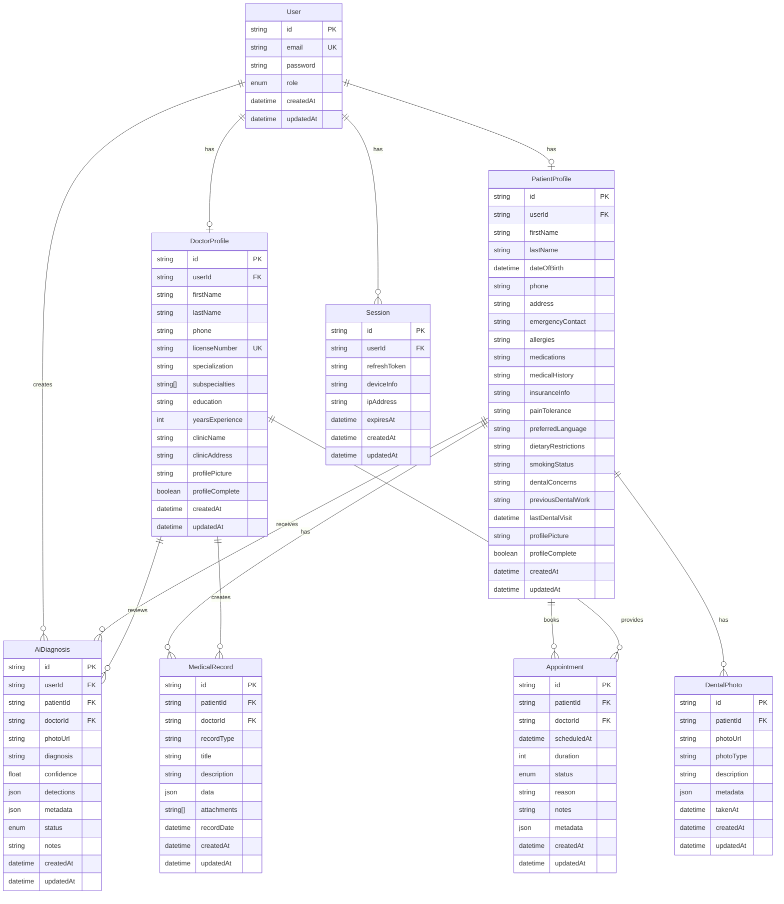

# Database Schema - PostgreSQL with Prisma

## Overview

Database Dentalization App menggunakan PostgreSQL dengan Prisma ORM untuk type-safe database operations. Schema dirancang untuk mendukung multi-role system dengan data medical yang komprehensif.

## Entity Relationship Diagram



## Prisma Schema

### Core Models

#### User Model
```prisma
model User {
  id        String   @id @default(cuid())
  email     String   @unique
  password  String
  role      Role     @default(PATIENT)
  createdAt DateTime @default(now())
  updatedAt DateTime @updatedAt
  
  // Profile relationships (one-to-one)
  doctorProfile  DoctorProfile?
  patientProfile PatientProfile?
  
  // Session management
  sessions Session[]
  
  // AI Diagnoses created by this user
  aiDiagnoses AiDiagnosis[]
  
  @@map("users")
}

enum Role {
  PATIENT
  DOCTOR
  ADMIN
}
```

#### Doctor Profile Model
```prisma
model DoctorProfile {
  id                String    @id @default(cuid())
  userId            String    @unique
  user              User      @relation(fields: [userId], references: [id], onDelete: Cascade)
  
  // Personal information
  firstName         String
  lastName          String
  phone             String?
  
  // Professional information
  licenseNumber     String    @unique
  specialization    String?
  subspecialties    String[]  // Array of subspecialties
  education         String?
  yearsExperience   Int?
  
  // Practice information
  clinicName        String?
  clinicAddress     String?
  clinicPhone       String?
  
  // Profile settings
  profilePicture    String?
  profileComplete   Boolean   @default(false)
  isVerified        Boolean   @default(false)
  
  createdAt         DateTime  @default(now())
  updatedAt         DateTime  @updatedAt
  
  // Relationships
  aiDiagnosesReviewed AiDiagnosis[] @relation("DoctorReviews")
  medicalRecords      MedicalRecord[]
  appointments        Appointment[]
  
  @@map("doctor_profiles")
}
```

#### Patient Profile Model
```prisma
model PatientProfile {
  id               String    @id @default(cuid())
  userId           String    @unique
  user             User      @relation(fields: [userId], references: [id], onDelete: Cascade)
  
  // Personal information
  firstName        String
  lastName         String
  dateOfBirth      DateTime?
  phone            String?
  address          String?
  emergencyContact String?
  
  // Medical information
  allergies        String?
  medications      String?
  medicalHistory   String?
  insuranceInfo    String?
  painTolerance    String?
  preferredLanguage String?
  dietaryRestrictions String?
  smokingStatus    String?
  
  // Dental specific
  dentalConcerns   String?
  previousDentalWork String?
  lastDentalVisit  DateTime?
  
  // App-specific
  profilePicture   String?
  profileComplete  Boolean   @default(false)
  createdAt        DateTime  @default(now())
  updatedAt        DateTime  @updatedAt
  
  // Relationships
  dentalPhotos     DentalPhoto[]
  medicalRecords   MedicalRecord[]
  aiDiagnoses      AiDiagnosis[] @relation("PatientDiagnoses")
  appointments     Appointment[]
  
  @@map("patient_profiles")
}
```

### Medical Data Models

#### AI Diagnosis Model
```prisma
model AiDiagnosis {
  id          String            @id @default(cuid())
  
  // User who created the diagnosis
  userId      String
  user        User              @relation(fields: [userId], references: [id], onDelete: Cascade)
  
  // Patient receiving the diagnosis
  patientId   String?
  patient     PatientProfile?   @relation("PatientDiagnoses", fields: [patientId], references: [id])
  
  // Doctor reviewing the diagnosis
  doctorId    String?
  doctor      DoctorProfile?    @relation("DoctorReviews", fields: [doctorId], references: [id])
  
  // Diagnosis data
  photoUrl    String
  diagnosis   String
  confidence  Float
  detections  Json              // Array of detected conditions
  metadata    Json?             // Additional AI metadata
  
  // Status and notes
  status      DiagnosisStatus   @default(PENDING)
  notes       String?
  
  createdAt   DateTime          @default(now())
  updatedAt   DateTime          @updatedAt
  
  @@map("ai_diagnoses")
}

enum DiagnosisStatus {
  PENDING
  REVIEWED
  CONFIRMED
  REJECTED
}
```

#### Dental Photo Model
```prisma
model DentalPhoto {
  id          String         @id @default(cuid())
  patientId   String
  patient     PatientProfile @relation(fields: [patientId], references: [id], onDelete: Cascade)
  
  photoUrl    String
  photoType   String         // "intraoral", "extraoral", "xray", etc.
  description String?
  metadata    Json?          // Camera settings, location, etc.
  
  takenAt     DateTime       @default(now())
  createdAt   DateTime       @default(now())
  updatedAt   DateTime       @updatedAt
  
  @@map("dental_photos")
}
```

#### Medical Record Model
```prisma
model MedicalRecord {
  id          String         @id @default(cuid())
  patientId   String
  patient     PatientProfile @relation(fields: [patientId], references: [id], onDelete: Cascade)
  
  doctorId    String?
  doctor      DoctorProfile? @relation(fields: [doctorId], references: [id])
  
  recordType  String         // "diagnosis", "treatment", "prescription", etc.
  title       String
  description String
  data        Json?          // Structured record data
  attachments String[]       // File URLs
  
  recordDate  DateTime       @default(now())
  createdAt   DateTime       @default(now())
  updatedAt   DateTime       @updatedAt
  
  @@map("medical_records")
}
```

### Session Management

#### Session Model
```prisma
model Session {
  id           String   @id @default(cuid())
  userId       String
  user         User     @relation(fields: [userId], references: [id], onDelete: Cascade)
  
  refreshToken String   @unique
  deviceInfo   String?
  ipAddress    String?
  
  expiresAt    DateTime
  createdAt    DateTime @default(now())
  updatedAt    DateTime @updatedAt
  
  @@map("sessions")
}
```

### Appointment System

#### Appointment Model
```prisma
model Appointment {
  id          String            @id @default(cuid())
  patientId   String
  patient     PatientProfile    @relation(fields: [patientId], references: [id], onDelete: Cascade)
  
  doctorId    String
  doctor      DoctorProfile     @relation(fields: [doctorId], references: [id], onDelete: Cascade)
  
  scheduledAt DateTime
  duration    Int               // Duration in minutes
  status      AppointmentStatus @default(SCHEDULED)
  reason      String
  notes       String?
  metadata    Json?             // Additional appointment data
  
  createdAt   DateTime          @default(now())
  updatedAt   DateTime          @updatedAt
  
  @@map("appointments")
}

enum AppointmentStatus {
  SCHEDULED
  CONFIRMED
  IN_PROGRESS
  COMPLETED
  CANCELLED
  NO_SHOW
}
```

## Database Indexes

### Performance Indexes
```sql
-- User lookups
CREATE INDEX idx_users_email ON users(email);
CREATE INDEX idx_users_role ON users(role);

-- Profile lookups
CREATE INDEX idx_doctor_profiles_license ON doctor_profiles(license_number);
CREATE INDEX idx_patient_profiles_user_id ON patient_profiles(user_id);

-- AI Diagnosis queries
CREATE INDEX idx_ai_diagnoses_user_id ON ai_diagnoses(user_id);
CREATE INDEX idx_ai_diagnoses_patient_id ON ai_diagnoses(patient_id);
CREATE INDEX idx_ai_diagnoses_created_at ON ai_diagnoses(created_at DESC);
CREATE INDEX idx_ai_diagnoses_status ON ai_diagnoses(status);

-- Session management
CREATE INDEX idx_sessions_user_id ON sessions(user_id);
CREATE INDEX idx_sessions_expires_at ON sessions(expires_at);
CREATE INDEX idx_sessions_refresh_token ON sessions(refresh_token);

-- Appointment queries
CREATE INDEX idx_appointments_patient_id ON appointments(patient_id);
CREATE INDEX idx_appointments_doctor_id ON appointments(doctor_id);
CREATE INDEX idx_appointments_scheduled_at ON appointments(scheduled_at);
CREATE INDEX idx_appointments_status ON appointments(status);
```

## Data Relationships

### One-to-One Relationships
- `User` ↔ `DoctorProfile`
- `User` ↔ `PatientProfile`

### One-to-Many Relationships
- `User` → `Session[]`
- `User` → `AiDiagnosis[]`
- `PatientProfile` → `DentalPhoto[]`
- `PatientProfile` → `MedicalRecord[]`
- `PatientProfile` → `AiDiagnosis[]`
- `DoctorProfile` → `AiDiagnosis[]` (reviews)
- `DoctorProfile` → `MedicalRecord[]`

### Many-to-Many Relationships
- `PatientProfile` ↔ `DoctorProfile` (through `Appointment`)

## Query Examples

### Common Queries

#### Get User with Profile
```javascript
const user = await prisma.user.findUnique({
  where: { email: 'user@example.com' },
  include: {
    doctorProfile: true,
    patientProfile: true
  }
});
```

#### Get Patient's AI Diagnosis History
```javascript
const diagnoses = await prisma.aiDiagnosis.findMany({
  where: {
    patientId: patientId
  },
  include: {
    doctor: {
      select: {
        firstName: true,
        lastName: true,
        specialization: true
      }
    }
  },
  orderBy: {
    createdAt: 'desc'
  },
  take: 10
});
```

#### Get Doctor's Patients
```javascript
const patients = await prisma.aiDiagnosis.findMany({
  where: {
    doctorId: doctorId
  },
  include: {
    patient: {
      select: {
        firstName: true,
        lastName: true,
        dateOfBirth: true
      }
    }
  },
  distinct: ['patientId']
});
```

#### Complex Query with Aggregation
```javascript
const stats = await prisma.aiDiagnosis.groupBy({
  by: ['status'],
  where: {
    doctorId: doctorId,
    createdAt: {
      gte: new Date(Date.now() - 30 * 24 * 60 * 60 * 1000) // Last 30 days
    }
  },
  _count: {
    id: true
  }
});
```

## Data Validation

### Prisma Validation
```prisma
model User {
  email    String @unique @db.VarChar(255)
  password String @db.VarChar(255)
  
  @@map("users")
}

model DoctorProfile {
  licenseNumber String @unique @db.VarChar(50)
  phone         String? @db.VarChar(20)
  
  @@map("doctor_profiles")
}
```

### Application-Level Validation
```javascript
const { z } = require('zod');

const userSchema = z.object({
  email: z.string().email(),
  password: z.string().min(8),
  role: z.enum(['PATIENT', 'DOCTOR', 'ADMIN'])
});

const aiDiagnosisSchema = z.object({
  photoUrl: z.string().url(),
  diagnosis: z.string().min(1),
  confidence: z.number().min(0).max(1),
  detections: z.array(z.object({
    condition: z.string(),
    confidence: z.number(),
    location: z.object({
      x: z.number(),
      y: z.number(),
      width: z.number(),
      height: z.number()
    })
  }))
});
```

## Migration Strategy

### Database Migrations
```bash
# Generate migration
npx prisma migrate dev --name add_ai_diagnosis

# Apply migration to production
npx prisma migrate deploy

# Reset database (development only)
npx prisma migrate reset
```

### Seed Data
```javascript
// prisma/seed.js
const { PrismaClient } = require('@prisma/client');
const bcrypt = require('bcryptjs');

const prisma = new PrismaClient();

async function main() {
  // Create admin user
  const adminPassword = await bcrypt.hash('admin123', 10);
  const admin = await prisma.user.create({
    data: {
      email: 'admin@dentalization.com',
      password: adminPassword,
      role: 'ADMIN'
    }
  });
  
  // Create sample doctor
  const doctorPassword = await bcrypt.hash('doctor123', 10);
  const doctor = await prisma.user.create({
    data: {
      email: 'doctor@dentalization.com',
      password: doctorPassword,
      role: 'DOCTOR',
      doctorProfile: {
        create: {
          firstName: 'Dr. John',
          lastName: 'Smith',
          licenseNumber: 'DDS12345',
          specialization: 'General Dentistry',
          yearsExperience: 10,
          profileComplete: true
        }
      }
    }
  });
}

main()
  .catch((e) => {
    console.error(e);
    process.exit(1);
  })
  .finally(async () => {
    await prisma.$disconnect();
  });
```

## Backup and Recovery

### Backup Strategy
```bash
# Daily backup
pg_dump dentalization_db > backup_$(date +%Y%m%d).sql

# Compressed backup
pg_dump dentalization_db | gzip > backup_$(date +%Y%m%d).sql.gz

# Backup with custom format
pg_dump -Fc dentalization_db > backup_$(date +%Y%m%d).dump
```

### Recovery
```bash
# Restore from SQL backup
psql dentalization_db < backup_20231201.sql

# Restore from custom format
pg_restore -d dentalization_db backup_20231201.dump
```

## Performance Considerations

### Query Optimization
- Use appropriate indexes for frequent queries
- Implement pagination for large datasets
- Use `select` to limit returned fields
- Implement database connection pooling

### Monitoring
- Monitor slow queries
- Track database performance metrics
- Implement query logging in development
- Use database monitoring tools

### Scaling
- Read replicas for read-heavy workloads
- Database sharding for large datasets
- Connection pooling with PgBouncer
- Caching frequently accessed data