# System Diagrams - Dentalization App

Dokumen ini berisi berbagai diagram sistem yang melengkapi dokumentasi arsitektur Dentalization App, termasuk use case diagram, sequence diagram, activity diagram, dan diagram lainnya.

## 📋 Daftar Diagram

1. [Use Case Diagram](#use-case-diagram)
2. [Sequence Diagrams](#sequence-diagrams)
3. [Activity Diagrams](#activity-diagrams)
4. [State Diagrams](#state-diagrams)
5. [Component Interaction Diagram](#component-interaction-diagram)
6. [Data Flow Diagram](#data-flow-diagram)
7. [Network Architecture Diagram](#network-architecture-diagram)

---

## Use Case Diagram

### Overview
Diagram use case menunjukkan interaksi antara aktor (pengguna) dengan sistem Dentalization App.

```mermaid
graph TB
    subgraph "Dentalization App System"
        subgraph "Authentication"
            UC1["Register Account"]
            UC2["Login"]
            UC3["Logout"]
            UC4["Reset Password"]
        end
        
        subgraph "Profile Management"
            UC5["View Profile"]
            UC6["Update Profile"]
            UC7["Upload Avatar"]
        end
        
        subgraph "AI Diagnosis"
            UC8["Upload Dental Photo"]
            UC9["Get AI Diagnosis"]
            UC10["View Diagnosis History"]
            UC11["Share Diagnosis"]
        end
        
        subgraph "Doctor Features"
            UC12["Review Diagnosis"]
            UC13["Approve/Reject Diagnosis"]
            UC14["View Patient List"]
            UC15["View Dashboard Stats"]
            UC16["Send Recommendations"]
        end
        
        subgraph "Patient Features"
            UC17["View Dashboard"]
            UC18["Book Appointment"]
            UC19["View Medical Records"]
            UC20["Receive Notifications"]
        end
        
        subgraph "Admin Features"
            UC21["Manage Users"]
            UC22["View System Analytics"]
            UC23["Manage AI Model"]
            UC24["System Configuration"]
        end
    end
    
    %% Actors
    Patient(("👤 Patient"))
    Doctor(("👨‍⚕️ Doctor"))
    Admin(("👨‍💼 Admin"))
    AISystem(("🤖 AI System"))
    
    %% Patient Use Cases
    Patient --> UC1
    Patient --> UC2
    Patient --> UC3
    Patient --> UC4
    Patient --> UC5
    Patient --> UC6
    Patient --> UC7
    Patient --> UC8
    Patient --> UC9
    Patient --> UC10
    Patient --> UC11
    Patient --> UC17
    Patient --> UC18
    Patient --> UC19
    Patient --> UC20
    
    %% Doctor Use Cases
    Doctor --> UC1
    Doctor --> UC2
    Doctor --> UC3
    Doctor --> UC4
    Doctor --> UC5
    Doctor --> UC6
    Doctor --> UC7
    Doctor --> UC12
    Doctor --> UC13
    Doctor --> UC14
    Doctor --> UC15
    Doctor --> UC16
    
    %% Admin Use Cases
    Admin --> UC1
    Admin --> UC2
    Admin --> UC3
    Admin --> UC21
    Admin --> UC22
    Admin --> UC23
    Admin --> UC24
    
    %% AI System
    AISystem --> UC9
    AISystem --> UC23
```

---

## Sequence Diagrams

### 1. User Authentication Flow

### 2. AI Diagnosis Process

### 3. File Upload Process

---

## Activity Diagrams

### 1. Patient Registration Flow

### 2. AI Diagnosis Workflow

---

## State Diagrams

### 1. User Authentication State

### 2. Diagnosis Status State

---

## Component Interaction Diagram

---

## Data Flow Diagram

### Level 0 - Context Diagram

### Level 1 - System Breakdown

---

## Network Architecture Diagram

```mermaid
graph TB
    subgraph "Client Devices"
        iOS["📱 iOS App"]
        Android["📱 Android App"]
        Web["💻 Web Admin"]
    end
    
    subgraph "CDN & Load Balancer"
        CDN["🌐 CloudFront CDN"]
        ALB["⚖️ Application Load Balancer"]
    end
    
    subgraph "Public Subnet"
        NAT["🔄 NAT Gateway"]
        Bastion["🔒 Bastion Host"]
    end
    
    subgraph "Private Subnet - App Tier"
        API1["🔧 API Server 1"]
        API2["🔧 API Server 2"]
        API3["🔧 API Server 3"]
    end
    
    subgraph "Private Subnet - Data Tier"
        RDS["🗄️ RDS PostgreSQL"]
        Redis["⚡ ElastiCache Redis"]
        S3["📁 S3 Bucket"]
    end
    
    subgraph "External Services"
        AI["🤖 AI/ML Service"]
        Email["📧 SES Email"]
        Push["📲 FCM/APNS"]
    end
    
    subgraph "Monitoring & Logging"
        CloudWatch["📊 CloudWatch"]
        Logs["📝 CloudWatch Logs"]
    end
    
    %% Client connections
    iOS --> CDN
    Android --> CDN
    Web --> CDN
    
    %% CDN and Load Balancer
    CDN --> ALB
    ALB --> API1
    ALB --> API2
    ALB --> API3
    
    %% API to Data connections
    API1 --> RDS
    API1 --> Redis
    API1 --> S3
    API2 --> RDS
    API2 --> Redis
    API2 --> S3
    API3 --> RDS
    API3 --> Redis
    API3 --> S3
    
    %% External service connections
    API1 --> AI
    API1 --> Email
    API1 --> Push
    API2 --> AI
    API2 --> Email
    API2 --> Push
    API3 --> AI
    API3 --> Email
    API3 --> Push
    
    %% Monitoring
    API1 --> CloudWatch
    API2 --> CloudWatch
    API3 --> CloudWatch
    RDS --> CloudWatch
    Redis --> CloudWatch
    
    API1 --> Logs
    API2 --> Logs
    API3 --> Logs
    
    %% Admin access
    Bastion -.-> API1
    Bastion -.-> API2
    Bastion -.-> API3
    Bastion -.-> RDS
```

---

## Diagram Usage Guidelines

### 1. Use Case Diagram
- **Tujuan**: Memahami fungsionalitas sistem dari perspektif pengguna
- **Audience**: Product managers, stakeholders, developers
- **Update**: Saat ada fitur baru atau perubahan requirement

### 2. Sequence Diagrams
- **Tujuan**: Memahami alur interaksi antar komponen
- **Audience**: Developers, system architects
- **Update**: Saat ada perubahan API atau business logic

### 3. Activity Diagrams
- **Tujuan**: Memahami alur proses bisnis
- **Audience**: Business analysts, QA engineers
- **Update**: Saat ada perubahan workflow atau business rules

### 4. State Diagrams
- **Tujuan**: Memahami status dan transisi objek
- **Audience**: Developers, testers
- **Update**: Saat ada perubahan state management

### 5. Component Interaction
- **Tujuan**: Memahami arsitektur dan dependencies
- **Audience**: System architects, senior developers
- **Update**: Saat ada perubahan arsitektur

### 6. Data Flow Diagram
- **Tujuan**: Memahami alur data dalam sistem
- **Audience**: Data architects, security engineers
- **Update**: Saat ada perubahan data flow atau security requirements

### 7. Network Architecture
- **Tujuan**: Memahami infrastruktur dan deployment
- **Audience**: DevOps engineers, infrastructure team
- **Update**: Saat ada perubahan infrastruktur atau deployment strategy

---

**Catatan**: Semua diagram ini harus diupdate secara berkala seiring dengan evolusi sistem dan dijaga konsistensinya dengan implementasi aktual.