# Mermaid Diagrams Overview

This document collects key system diagrams expressed in [Mermaid](https://mermaid.js.org/) syntax. Each section focuses on a major repository area.

## Repository Structure
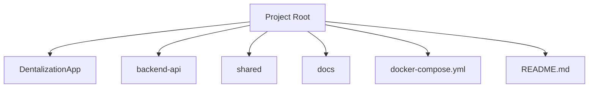

## Mobile App Directory
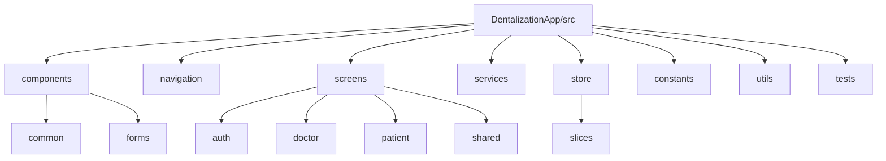

### Mobile Components
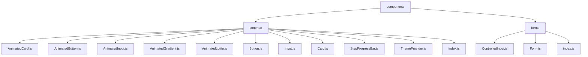

### Mobile Screens
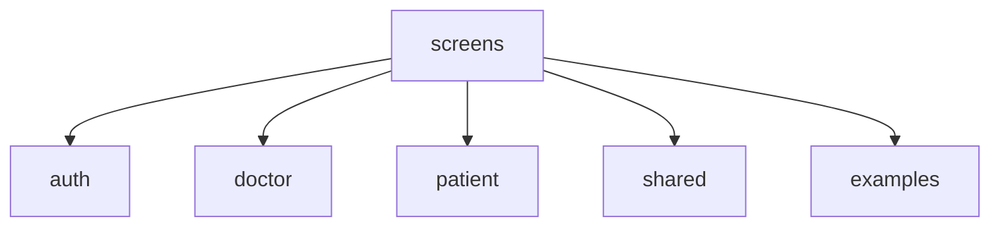

### Mobile Services
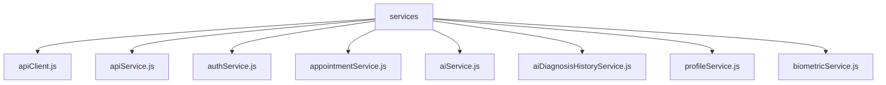

### Mobile Store
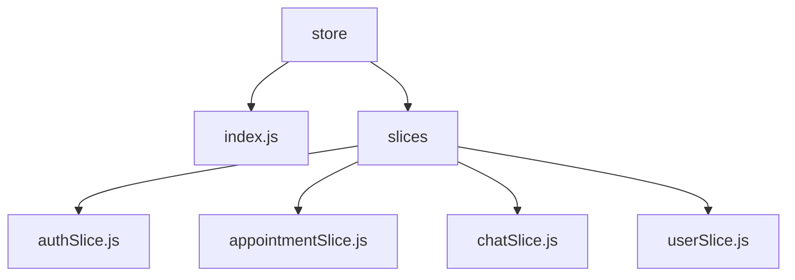

## Backend API Directory
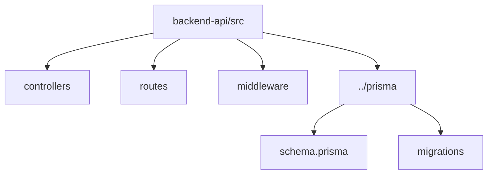

### Backend Controllers
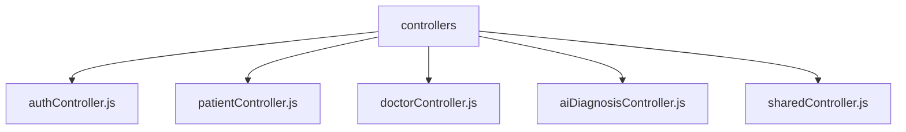

### Backend Routes
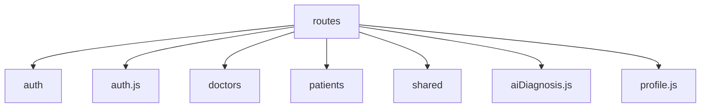

### Backend Middleware
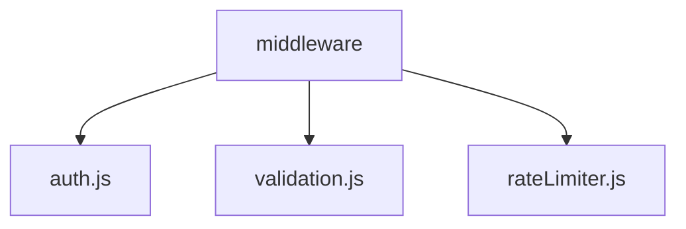

### Prisma Resources
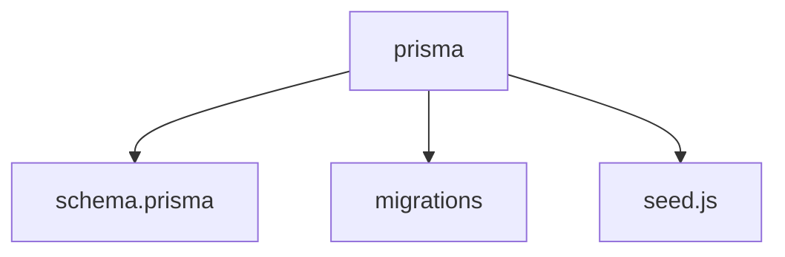

## Shared Utilities
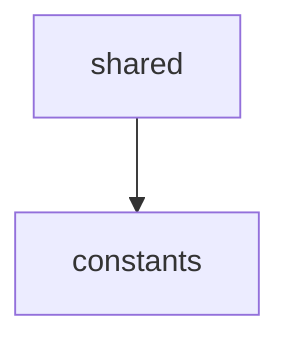

### Shared Constants
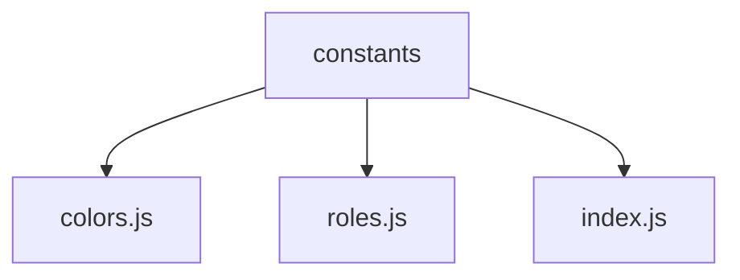

## Documentation Structure
```mermaid
graph TD
    docs[docs]
    docs --> architecture
    docs --> apiDoc[API_DOCUMENTATION.md]
    docs --> qsa[QUICK_START_AUTHENTICATION.md]
    docs --> qsb[QUICK_START_BACKEND.md]
    docs --> tailwind[TAILWIND_STYLING.md]
    docs --> styling[STYLING_REFACTOR_SUMMARY.md]
    docs --> phase4[PHASE2_WEEK4_COMPLETE.md]
    docs --> phase5[PHASE2_WEEK5_IMPLEMENTATION.md]
    docs --> week4[WEEK4_AUTHENTICATION_IMPLEMENTATION.md]
    architecture --> o1[01-overview.md]
    architecture --> o2[02-frontend-architecture.md]
    architecture --> o3[03-backend-architecture.md]
    architecture --> o4[04-database-schema.md]
    architecture --> o5[05-api-endpoints.md]
    architecture --> o6[06-deployment-devops.md]
    architecture --> o7[07-security-best-practices.md]
    architecture --> o8[08-testing-strategy.md]
    architecture --> o9[09-system-diagrams.md]
```

## Database Entity Relationship Diagram
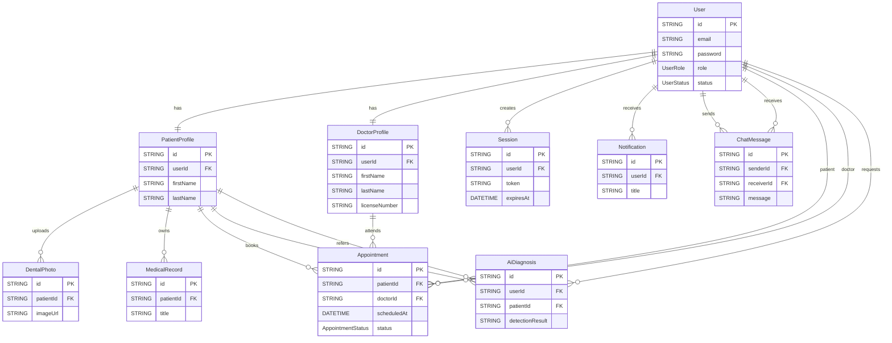
